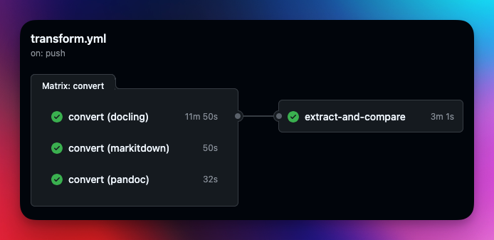

# Legacy Document Transformation Demo

Convert compliance documents (DOCX, PDF) to machine-readable formats (Markdown, JSON) for programmatic querying and analysis.

> **Note**: This is a reference implementation to help teams explore document transformation approaches. Adapt the scripts and workflows to fit your organization's specific needs and security requirements.

## Quick Start

```bash
# Option 1: GitHub Actions
# Push docs to docs/sample/ or docs/byod/, workflow runs automatically

# Option 2: Docker
docker-compose up pandoc markitdown docling
docker-compose run extract

# Option 3: Local
pip install -r requirements.txt
./scripts/convert/run-pandoc.sh docs/sample output/pandoc/markdown
python scripts/convert/run-markitdown.py docs/sample output/markitdown/markdown
python scripts/convert/run-docling.py docs/sample output/docling/markdown
python scripts/extract/extract-controls.py output/ output/extracted/controls.json
```

## Pipeline



## Conversion Tools

| Tool | Strengths | Install |
|------|-----------|---------|
| [Pandoc](https://pandoc.org/) | Fast, reliable, well-established | `apt install pandoc` |
| [MarkItDown](https://github.com/microsoft/markitdown) | LLM-optimized, handles many formats | `pip install markitdown[all]` |
| [Docling](https://github.com/DS4SD/docling) | Deep document understanding, tables | `pip install docling` |

All three run in parallel via GitHub Actions matrix strategy.

## Output Structure

```
output/
├── pandoc/markdown/*.md
├── markitdown/markdown/*.md
├── docling/markdown/*.md
└── extracted/
    ├── controls.json    # NIST 800-53 control references
    ├── metadata.json    # Document metadata
    └── entities.json    # Roles, systems, standards
```

## Query Scripts

### Find Controls

```bash
./scripts/query/find-controls.sh AC          # All Access Control refs
./scripts/query/find-controls.sh AC-2        # Specific control
./scripts/query/find-controls.sh "AC-2(1)"   # Enhancement
```

### Coverage Analysis

```bash
./scripts/query/count-by-family.sh
# Output:
# AC    45    █████████
# AU    23    ████
# Family coverage: 60%
```

### Compare Tools

```bash
./scripts/query/compare-tools.sh sample-access-control-policy
# Shows word count, table detection, control refs per tool
```

### KSI Evidence Check

```bash
./scripts/query/fedramp-20x-ksi-check.sh
# Maps documentation to FedRAMP 20x Key Security Indicators
```

### Custom jq Queries

```bash
# Top referenced controls
jq '[.controls | group_by(.control_id) | .[] | {control: .[0].control_id, count: length}] | sort_by(-.count) | .[0:10]' output/extracted/controls.json

# Control family distribution
jq '.summary.by_family' output/extracted/controls.json

# Find all roles
jq '.entities[] | select(.entity_type == "role") | .value' output/extracted/entities.json

# Controls in SSP but not POA&M
comm -23 \
  <(jq -r '.controls[] | select(.source_document | contains("ssp")) | .control_id' output/extracted/controls.json | sort -u) \
  <(jq -r '.controls[] | select(.source_document | contains("poam")) | .control_id' output/extracted/controls.json | sort -u)
```

## Supported Formats

| Format | Pandoc | MarkItDown | Docling |
|--------|:------:|:----------:|:-------:|
| DOCX   | Y | Y | Y |
| PDF    | Limited | Y | Y |
| PPTX   | Y | Y | Y |
| XLSX   | Limited | Y | Y |
| HTML   | Y | Y | Y |

## Adding Your Documents

```bash
# Add to repo
cp /path/to/doc.docx docs/byod/
git add docs/byod/ && git commit -m "Add docs" && git push

# Or run locally for sensitive docs
./scripts/convert/run-pandoc.sh /path/to/docs output/pandoc/markdown
```

For best results:
- Use semantic headings (H1, H2, H3)
- Tables should have header rows
- Use standard control IDs: `AC-1`, `SC-7(1)`, not `Access Control 1`

## FedRAMP 20x Measurement Approach

Traditional: "Do I have the document?"
Better: "What can I measure from this documentation?"

Example measurements enabled by this pipeline:

```bash
# Control coverage percentage
jq '.summary.by_family | keys | length' output/extracted/controls.json
# 15 of 20 families = 75% coverage

# Cross-document consistency (controls in SSP not in POA&M)
comm -23 <(jq -r '...' ssp.json) <(jq -r '...' poam.json)

# Role assignment coverage
jq '[.entities[] | select(.entity_type == "role")] | length' output/extracted/entities.json
```

## Repository Structure

```
.github/workflows/transform.yml  # GitHub Actions (matrix: pandoc, markitdown, docling)
docs/sample/                     # Sample FedRAMP docs
docs/byod/                       # Your docs (gitignored)
scripts/convert/                 # Conversion scripts
scripts/extract/                 # JSON extraction (controls, metadata, entities)
scripts/query/                   # grep/jq query examples
docker/                          # Dockerfiles
```

## License

MIT
